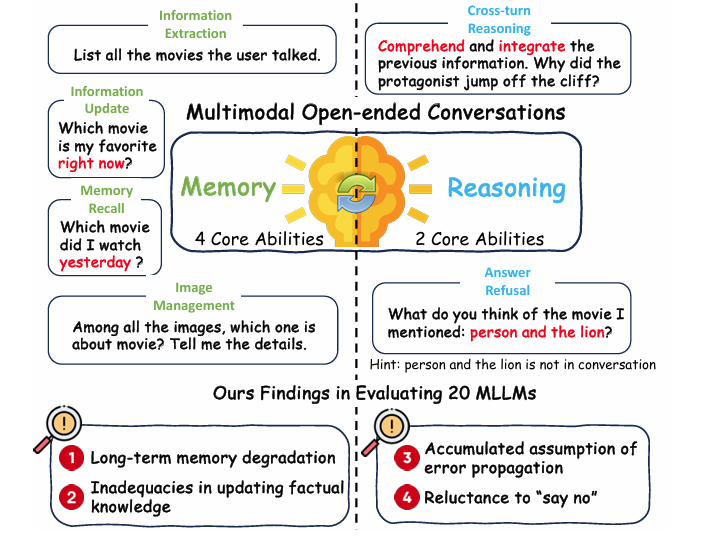

## 🧑💬 MMRC: A Large-Scale Benchmark for Understanding Multimodal Large Language Model in Real-World Conversation

This repo presents the implementation of the **MMRC 💬** , You can find the paper on [arXiv](https://arxiv.org/abs/2502.11903).

## Key Features of MMRC 🔑

1. **First Multimodal Open-Domain Dialogue Benchmark**  
   MMRC is the first evaluation benchmark for multimodal open-domain conversations (OEC), enabling a comprehensive assessment of multimodal large language models (MLLMs) in real-world dialogue scenarios.
2. **Comprehensive Evaluation Framework with Six Core Abilities**  
   MMRC introduces six core abilities (Information Extraction, Cross-turn Reasoning, Information Updating, Image Management, Memory Retrieval, and Answer Refusal), covering a broader range of evaluation dimensions compared to existing benchmarks, providing a more complete framework for assessing dialogue capabilities.
3. **Analysis of 20 Major Models and Identification of Failure Modes**  
   The MMRC framework analyzes 20 leading MLLMs and uncovers four common failure modes in open-domain dialogue, offering valuable insights for future research.
4. **Real-World Data Collection**  
   Data for MMRC was collected through the Dialogflow platform, which integrates a variety of mainstream MLLMs. The data represents naturally occurring dialogues in real-world scenarios, ensuring the naturalness and representativeness of the dataset.
5. **Dialogue Turns and Categorization**  
   MMRC's dialogue turns range from 4 to 22, ensuring the dialogues are diverse and realistic. Additionally, a classification network maps dialogue data into 14 predefined categories, ensuring the dialogues cover a wide range of topics and are representative of real-world conversations.

## Stastics of MMRC 📊
