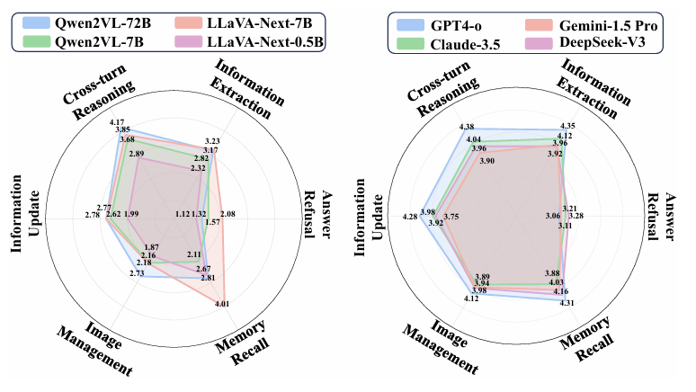

## 🧑💬 MMRC: A Large-Scale Benchmark for Understanding Multimodal Large Language Model in Real-World Conversation

This repo presents the implementation of the **MMRC 💬** . 
📖 paper on [arXiv](https://arxiv.org/abs/2502.11903)
💽 dataset on [huggingface](https://huggingface.co/datasets/WUUE/MMRC)

## Key Features of MMRC 🔑

1. **First Multimodal Open-Domain Dialogue Benchmark**  
   MMRC is the first evaluation benchmark for multimodal open-domain conversations (OEC), enabling a comprehensive assessment of multimodal large language models (MLLMs) in real-world dialogue scenarios.
2. **Comprehensive Evaluation Framework with Six Core Abilities**  
   MMRC introduces six core abilities (Information Extraction, Cross-turn Reasoning, Information Updating, Image Management, Memory Retrieval, and Answer Refusal), covering a broader range of evaluation dimensions compared to existing benchmarks, providing a more complete framework for assessing dialogue capabilities.
3. **Analysis of 20 Major Models and Identification of Failure Modes**  
   The MMRC framework analyzes 20 leading MLLMs and uncovers four common failure modes in open-domain dialogue, offering valuable insights for future research.
4. **Real-World Data Collection**  
   Data for MMRC was collected through the Dialogflow platform, which integrates a variety of mainstream MLLMs. The data represents naturally occurring dialogues in real-world scenarios, ensuring the naturalness and representativeness of the dataset.
5. **Dialogue Turns and Categorization**  
   MMRC's dialogue turns range from 4 to 22, ensuring the dialogues are diverse and realistic. Additionally, a classification network maps dialogue data into 14 predefined categories, ensuring the dialogues cover a wide range of topics and are representative of real-world conversations.

<div align=center></div>
<div align=center></div>

## Stastics of MMRC 📊

1. **Dialogue Turns Distribution:**  
The dialogue turns in MMRC are not fixed, ranging from 4 to 22 turns. This ensures the dialogues are more natural and realistic compared to other datasets like ConvBench and EVALDIAL, which use fixed turn structures.

2. **Dialogue Categorization**  
A classification network has been designed to map the dialogue data into 14 predefined categories. This ensures a balanced distribution of dialogue categories, covering a wide range of topics and making the dataset diverse and representative of real-world conversations.

<div align="center">
  
  
</div>

## Expriment and Key Finds 🌟
**Main results📝:**  
Our main results is shown in the table below:
<div align=center></div>

**Several Key finds⚡️:**  
We also have some visulation of our finds, details are in the paper: 
<div align=center></div>
<div align=center></div>
<div align=center></div>

## Citations
```
@article{xue2025mmrc, 
  title={MMRC: A Large-Scale Benchmark for Understanding Multimodal Large Language Model in Real-World Conversation},
  author={Xue, Haochen and Tang, Feilong and Hu, Ming and Liu, Yexin and Huang, Qidong and Li, Yulong and Liu, Chengzhi and Xu, Zhongxing and Zhang, Chong and Feng, Chun-Mei and others},
  journal={arXiv preprint arXiv:2502.11903},
  year={2025}
}
```
